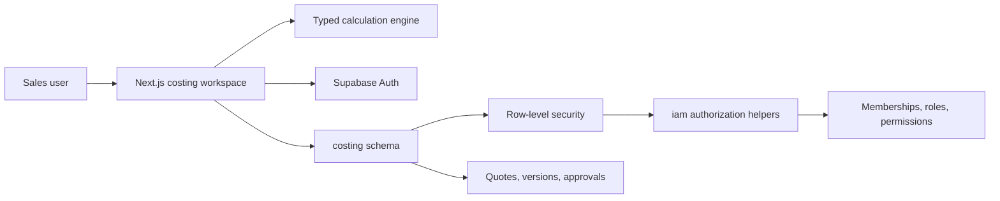

# Architecture

## Security model

- Frontend uses only the Supabase publishable key.
- All exposed tables have RLS enabled and explicit grants.
- Authorization is read from database-managed role assignments, never user-editable metadata.
- Quote owners can edit their own quote data, but a database trigger enforces the status path `draft → ready_for_review → manager_approved → ceo_approved → ready_for_export`.
- Manager and CEO transitions require separate permissions evaluated in PostgreSQL.
- Security-definer helpers live in unexposed private schemas, have fixed empty search paths, and have public execution revoked.

## Shared IAM extension pattern

To onboard another application:

1. Insert a row in `iam.applications`.
2. Add application-specific roles and permissions.
3. Bind roles through `iam.role_permissions`.
4. Add narrowly scoped RLS policies for that application's role assignments.
5. Assign roles per user and organisation.

The costing migration deliberately prevents a Costing Administrator from assigning roles for other applications. Shipment Visibility follows the same pattern under `application_key = 'visibility'` (see `20260715025400_shipment_visibility.sql`). First-org bootstrap grants both Costing and Visibility admin roles.
